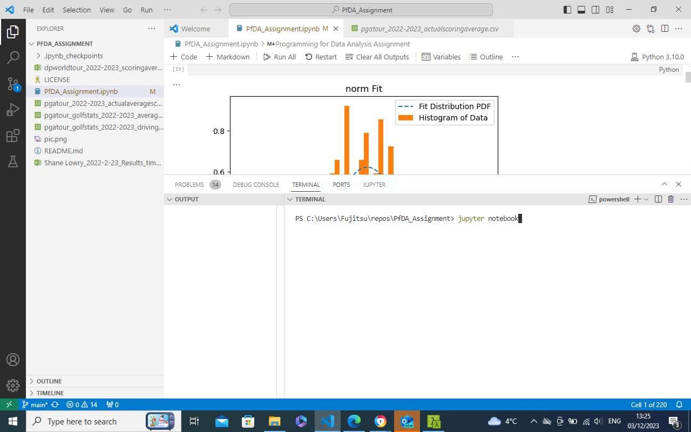
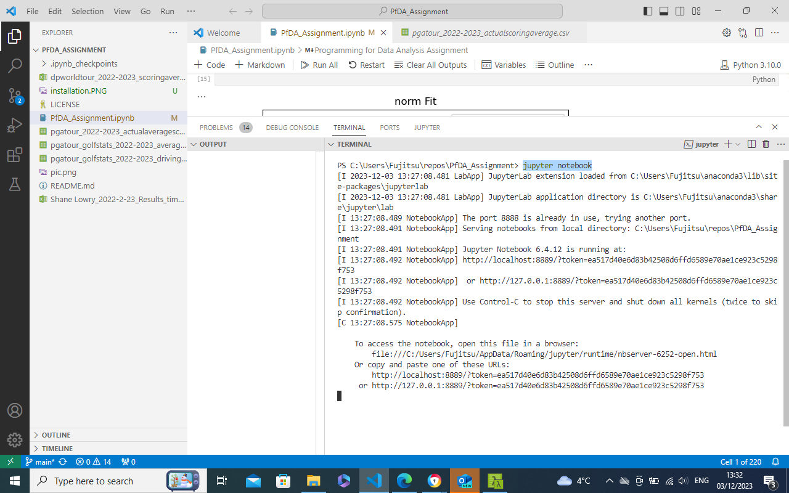
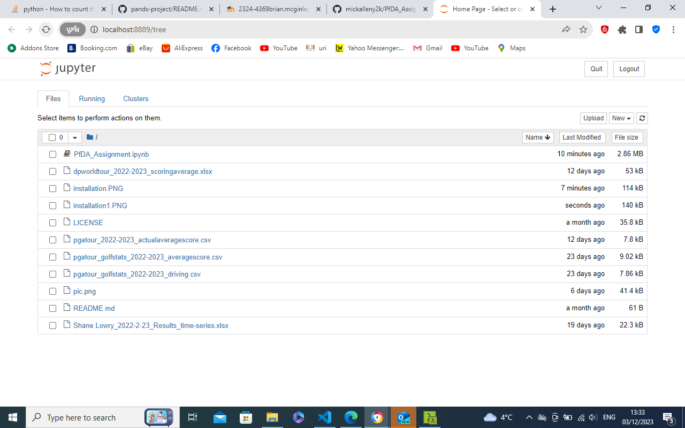

# PfDA_Assignment
Programming for Data Analysis Assignment

# Installation
- Change directory to PfDA_Assignment directory
- Run the Jupyter Notebook in Visual Studio Code terminal or cmder terminal
- Open the notebook PfDA_Assignment.ipynb
  

